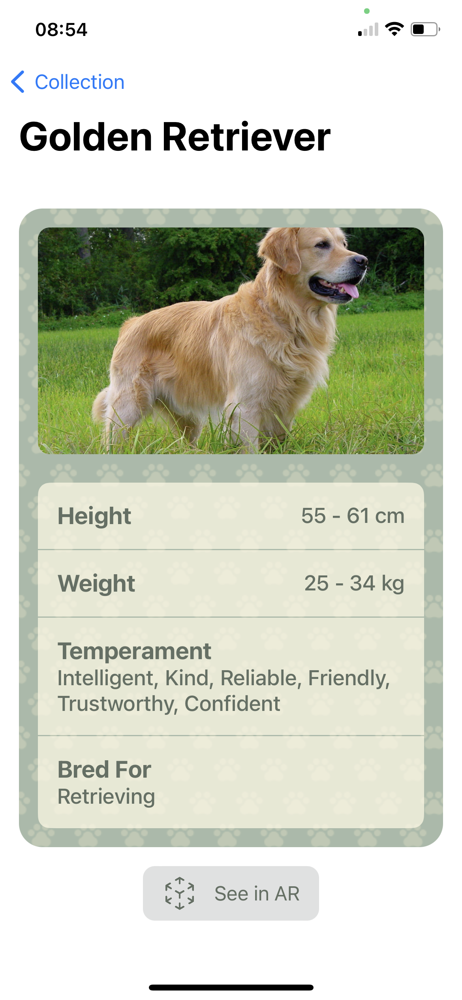

    

#  What a Dog

### An iOS app for dog lovers :dog: :heart:

## Overview

What a Dog is an app to detect dog's breed. With it you can take a picture of a dog and the app try to say its breed accordingly to a machine learning classification model. Also, you we provide a collection of existents breeds and general information about them. Furthermore, we tried to implement an augmented reality section for you to see a 3D model of any dog's specific breed.

Take a look at some screenshots:

| Camera                                   | Classification                           | Collection                               | Information                              | AR                                       |
| :--------------------------------------- | :--------------------------------------- | :--------------------------------------- | :--------------------------------------- | :--------------------------------------- |
|  |  |  |  |  |

## Features

- Guess what the dog's breed from a picture
- Add the discovered breed to your collection (On development)
- Get information about a breed
- See a 3D model for each breed (Missing the models)

## Test it now! :guide_dog:

What a Dog is available for testing in [Testflight](https://apps.apple.com/br/app/testflight/id899247664). To download it see this [link](https://testflight.apple.com/join/15Dr8Q9Q) or scan the QR code below.

We appreciate any feedback related to UI design, features and functionalities, app navigation and it will be nice to know if the classification model is working fine!

    

## Developed by:
- [Gabriel Muelas](https://www.linkedin.com/in/muelas/) 
- [Eduardo Dini](https://www.linkedin.com/in/eduardodini/)
- [Carolina Zanotto](https://www.linkedin.com/in/carolina-zanotto/)
- [Fernando Santos](https://www.linkedin.com/in/fer-comp/)
- [Letícia Ferreira](https://github.com/ltcfrr)
- [Larissa Gomes](https://www.linkedin.com/in/larissa-escaliante-96656a191/)
